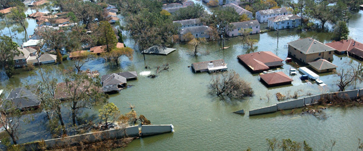

```{r global_options, include=FALSE}
knitr::opts_chunk$set(fig.width=8, fig.height=4, fig.path='Figs/',                              warning=FALSE, message=FALSE, comment="")
```

###**SYNOPSIS**
The devastating effects of storms and other severe weather events on humans, crops,and properties have made their prevention  a key concern.
Using the U.S. National Oceanic and Atmospheric Administration's (NOAA) storm database, I estimated the extent of fatalities, injuries, and property damage of major weather events.

Tornadoes and excessive heat were responsible for 34% of all fatalities and 45% of all injuries. The two with flood events caused 56% of injuries. Flood is the most non-human destructive event responsible for the loss of $137billion worth of crops and properties. Texas, Alabama, and MIssouri suffered the greatest human impact, accounting for 49% of all fatal and non-fatal injuries. The crop and property lost in California from 1995-2011 is worth about $120billion, 50% of the estimated loss.


###**Data**

The data is a comma-separated-value file compressed via the bzip2 algorithm. You can download the file here [Storm Data](https://d396qusza40orc.cloudfront.net/repdata%2Fdata%2FStormData.csv.bz2)

For more information on the database and variables definition, check these links:

* National Weather Service [Storm Data Documentation](https://d396qusza40orc.cloudfront.net/repdata%2Fpeer2_doc%2Fpd01016005curr.pdf)

* National Climatic Data Center Storm Events [FAQ](https://d396qusza40orc.cloudfront.net/repdata%2Fpeer2_doc%2FNCDC%20Storm%20Events-FAQ%20Page.pdf)

The events in the database start in the year 1950 and end in November 2011. In the earlier years of the database there are generally fewer events recorded, most likely due to a lack of good records. More recent years should be considered more complete.

###**DATA PROCESSING**

```{r load_libraries, include=FALSE}
library(dplyr)
library(ggplot2)
library(lubridate)
library(xtable)
```

```{r read, cache=TRUE}
storm <- read.table("StormData.csv.bz2", sep=",",  header=T)
dim(storm)
```
There are `r dim(storm)[1]` observations,but we already know that the data collected in the earlier years were incomplete and unreliable. Let us examine distribution of events across the years in the dataset.
```{r}
date <- mdy_hms(storm$BGN_DATE)
storm$year <- year(date)
summary(storm$year)
```
The events recorded before 1995 are sparse. Therefore, we will subset our data at the first quartile, 1995, and select the features relevant to this anlaysis.
```{r subset, cache=TRUE}
data <- storm%>%filter(year >= 1995)%>%
        select(EVTYPE, year, STATE, INJURIES, FATALITIES, PROPDMGEXP, PROPDMG,                         CROPDMGEXP, CROPDMG)
```
From the data documentation provided in the links above, some event types are duplicates and refer to the same events. They will all be combined into the same and appropriate event type.
```{r combine_variables}
data$EVTYPE = toupper(data$EVTYPE)
data[data$EVTYPE == "HURRICANE/TYPHOON", ]$EVTYPE = "HURRICANE-TYPHOON"
data[data$EVTYPE == "HURRICANE", ]$EVTYPE = "HURRICANE-TYPHOON"
data[data$EVTYPE == "RIVER FLOOD", ]$EVTYPE = "FLOOD"
data[data$EVTYPE == "TSTM WIND", ]$EVTYPE = "THUNDERSTORM WIND"
```
Let us clean the event type variable name.
```{r}
names(data)[names(data)=="EVTYPE"] <- "EVENT.TYPE"
```

###**RESULTS**

####*Human health impact*

Storm events directly affect human lives and health. The number of fatalities and the injured are aggregated by the type of storm events.

```{r human.injuries}
human.injuries <- data%>%group_by(EVENT.TYPE)%>%
        summarize(No.of.Fatalities=sum(FATALITIES), No.Injured=sum(INJURIES))
```

The proportion of fatalities caused by event types is computed and the top 5 deadly events are shown in the table below.

```{r fatal, results="asis"}
fatalities <- human.injuries%>%select(EVENT.TYPE, No.of.Fatalities)%>%
          mutate(proportion=No.of.Fatalities/sum(No.of.Fatalities))%>%
          arrange(desc(No.of.Fatalities))
print(xtable(fatalities%>%slice(1:5)), type="html")
```

From the table above, the five most fatal events in an increasing order of severity, `r unlist(fatalities[1:4,1])`, and `r unlist(fatalities[5,1])` are responsible for 59% of the fatalities between 1995 and 2011.

```{r fatal.plot}
g <- ggplot(fatalities%>%slice(1:10), aes(x=EVENT.TYPE, y=No.of.Fatalities, fill=EVENT.TYPE))
g + geom_bar(width=0.3) + geom_bar(stat="identity", colour="black", show_guide=FALSE) +
        theme(legend.title=element_blank(), axis.ticks=element_blank(),
              axis.text.x=element_blank(), panel.grid.minor.x=element_blank(),
              panel.grid.major.x=element_blank()) +
                 ggtitle("10 MOST FATAL WEATHER EVENTS IN THE US, 1996-2011") 
```

```{r injuries, results ="asis"}
injuries <- human.injuries%>%select(EVENT.TYPE, No.Injured)%>%
        mutate(proportion=No.Injured/sum(No.Injured))%>%
        arrange(desc(No.Injured))
print(xtable(injuries%>%slice(1:5)), type="html")
```

`r unlist(injuries[1,1])` is responsible for 35% of all injuries and in combination with `r unlist(fatalities[2,2])` and `r unlist(injuries[3,1])` caused 56% of injuries between 1995 and 2011.  
TORNADO and EXCESSIVE HEAT are collectively responsible for 34% of all fatalities and 45% of all injuries.

```{r injuries.plot}
g <- ggplot(injuries%>%slice(1:10), aes(x=EVENT.TYPE, y=No.Injured, fill=EVENT.TYPE))
g + geom_bar(width=0.3) + geom_bar(stat="identity", colour="black", show_guide=FALSE) +
theme(legend.title=element_blank(), axis.ticks=element_blank(),axis.text.x=element_blank(), panel.grid.minor.x=element_blank(), panel.grid.major.x=element_blank()) + 
xlab("Storm events") + ylab("Number of injuries") + 
ggtitle("10 WEATHER EVENTS WITH THE MOST NON-FATAL INJURIES\n IN THE US,1996-2011") 
```

####*Economic Consequence*

Crops and properties are not spared from the destructive nature of these weather events. To estimate the monetary value of these losses, we will use a subset of `data`. The magnitude of the loss is coded as letters: H,K,M,B, corresponding to 100, 1000, 1million, 1billion dollars respectively. Since the variables containing these characters also have lower case entries, We will convert them to upper case before we proceed.

```{r magn.upper}
data$PROPDMGEXP <- toupper(data$PROPDMGEXP)
data$CROPDMGEXP <- toupper(data$CROPDMGEXP)
```

Not all the magnitude variables entries are letters and therfore not useful.We will use a subset of the data that has relevant monetary magnitude for our economic analysis.

```{r econ.subet, cache=TRUE}
econ <- subset(data, data$PROPDMGEXP %in% c("H", "K", "M", "B") & 
                       data$CROPDMGEXP %in% c("H", "K", "M", "B"))
```

Check the unique values of our subset to ensure they are in the right format. "H" is not part of the unique values in the subset. 

```{r}
unique(econ$PROPDMGEXP); unique(econ$CROPDMGEXP)
```

The magnitude and the damage are multiplied to estimate the worth of the damaged crops and properties. 

```{r magtimes}
econ[econ$PROPDMGEXP=="K", ]$PROPDMG <- econ[econ$PROPDMGEXP=="K", ]$PROPDMG * 1000
econ[econ$PROPDMGEXP=="M", ]$PROPDMG <- econ[econ$PROPDMGEXP=="M", ]$PROPDMG * 1e+06
econ[econ$PROPDMGEXP=="B", ]$PROPDMG <- econ[econ$PROPDMGEXP=="B", ]$PROPDMG * 1e+09
econ[econ$CROPDMGEXP=="K", ]$CROPDMG <- econ[econ$CROPDMGEXP=="K", ]$CROPDMG * 1000
econ[econ$CROPDMGEXP=="M", ]$CROPDMG <- econ[econ$CROPDMGEXP=="M", ]$CROPDMG * 1e+06
econ[econ$CROPDMGEXP=="B", ]$CROPDMG <- econ[econ$CROPDMGEXP=="B", ]$CROPDMG * 1e+09
``` 

The total of the value of the damage to crops and properties aggregated by event type and the top 10 events is estimated below. 

```{r damage,results="asis"}
Damages <- econ%>%group_by(EVENT.TYPE)%>%summarize(total.damage=sum(PROPDMG, CROPDMG)/1e+09)%>% mutate(prop.damage=total.damage/sum(total.damage))%>%
arrange(desc(total.damage))
print(xtable(Damages%>%slice(1:5)),type="html")
```

The table above is the sum of the estimated value of crop and property lost to the top 5 storm and other weather events in billons. Tornado is responsible for 58% (137billion USD) of the total property and crop damages between 1995-2011. **Flood, hurricane-typhoon, and tornado** are collectively responsible for 83% (195billion USD) of estimated damages in dollars in the period under study.

```{r damageplot}
g <- ggplot(Damages%>%slice(1:10), aes(x=EVENT.TYPE, y=total.damage, fill=EVENT.TYPE))
g + geom_bar(width=0.3) + geom_bar(stat="identity", colour="black", show_guide=FALSE) + theme(legend.title=element_blank(), axis.ticks=element_blank(), axis.text.x=element_blank(), panel.grid.minor.x=element_blank(), panel.grid.major.x=element_blank()) +
xlab("STORM EVENTS") + ylab("TOTAL DAMAGE IN BILLIONS") +
ggtitle("TOP 10 ECONOMIC LOSS OF WEATHER EVENTS IN THE\n US, 1996-2011") 
```

####*Which states are most affected?*
For the human health impact, We will use the sum of fatalities and injuries for this analysis.
```{r state.impact}
state.impact <- econ%>%group_by(STATE)%>%
        summarize(total.injury=sum(FATALITIES, INJURIES),
                  total.damage=sum(PROPDMG, CROPDMG)/1e+09)
```
The table below shows the 5 states with the gretaest human impact.
```{r results="asis"}
inj <- state.impact%>%select(STATE,total.injury)%>%
        mutate(prop.injury=total.injury/sum(total.injury))%>%
        arrange(desc(total.injury))%>%slice(1:5)
print(xtable(inj),type="html")
```

27% of fatal and non-fatal injuries occurred in Texas and with Alabama and Missouri, houses 49% of total injuries. 

```{r results="asis"}
dam <- state.impact%>%select(STATE,total.damage)%>%
        mutate(prop.damage=total.damage/sum(total.damage))%>%
        arrange(desc(total.damage))%>%slice(1:5)
print(xtable(dam), type="html")
```
The table above shows the 5 states with the greatest loss of crops and properties. The worth of the crops and properties destroyed in California constitute 50% of all damages from 1995-2011.
```{r trend, eval=FALSE, include=FALSE}
Damage.trend <- econ%>%filter(EVENT.TYPE %in% Damages$EVENT.TYPE)%>%
        group_by(year, EVTYPE)%>%
         summarize(tot.damage=sum(PROPDMG, CROPDMG)/1e+09)
```

```{r eval=FALSE,include=FALSE}
ggplot(Damage.trend, aes(x=year,y=tot.damage,colour=EVTYPE))+geom_line(size=0.9) +
        scale_colour_discrete(name="Storm Events")+ ylab("Total damage in Billions") +
        ggtitle("Annual trend of the 10 most destructive storm events in US, 1996-2011")
```

```{r injury.trend, eval=FALSE, include=FALSE}
injury.trend <- human.injuries%>%select(EVENT.TYPE, Total.human.injuries)%>%
        arrange(desc(Total.human.injuries))%>%slice(1:10)
```

```{r eval=FALSE, include=FALSE}
injury.trend1 <- econ%>%filter(EVENT.TYPE %in% injury.trend$EVENT.TYPE)%>%
        group_by(year, EVENT.TYPE)%>%
         summarize(Total.human.injuries=sum(FATALITIES, INJURIES))
```

```{r injury.trend1, include=FALSE, eval=FALSE}
ggplot(injury.trend1, aes(x=year, y=Total.human.injuries, colour=EVENT.TYPE))+
        geom_line(size=0.9) +
        scale_colour_discrete(name="Storm Events") + 
        ylab("Fatal and non-fatal injuries") +
        ggtitle("Annual trend of the 10 most harmful storm events in US, 1996-2011")

```
###**CONCLUSION**
The most devastating events to humans were Flood, tornado, and excessive heat while to crops and properties were flood,hurricane, and tornado. Texas,Alabama, and Missouri suffered the greatest human impact while California and Florida suffered the greatest crop and property loss. An interesting future analysis will be to determine which events are common in each state. I will expect the events that have the highest human casualties to the common in Texas and the same concept applicable in California.
